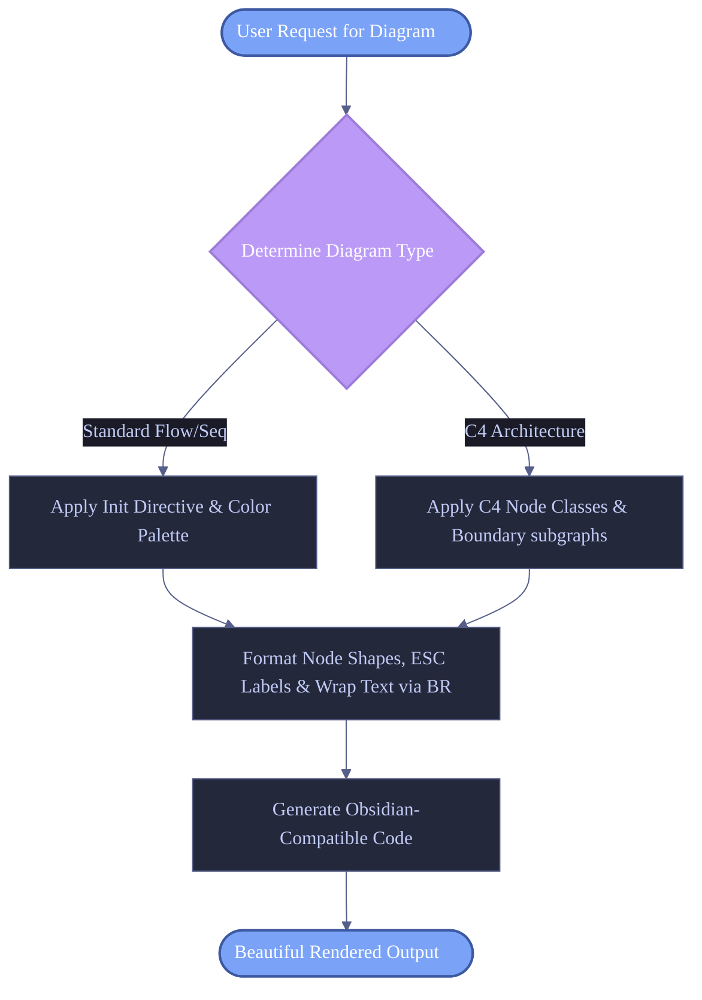

# Skill: beautiful-mermaid

Generate highly aesthetic Mermaid diagrams (Block, Sequence, Flowchart, C4 Context/Container/Component) optimized for Obsidian rendering and professional documentation.

---

## 📌 Description
`beautiful-mermaid` is a custom AI agent skill designed to guide LLMs in generating premium, professional-grade visual diagrams using Mermaid.js. It focuses on modern design aesthetics, curated color palettes (like Tokyo Night, Catppuccin, and Nord), advanced styling, text wrapping, and native implementation of C4 model architecture conventions without requiring external tools.

---

## 📌 Version Information
- **Current Version**: v2.2.0
- **Updated Date**: 2026-06-22

---

## 🕒 Change List
- **[2026-06-22] v2.2.0**:
  - Perfected hybrid fusion (v2.2.0 Masterpiece): Combined zero-dependency aesthetics with absolute Obsidian rendering safety iron rules.
  - Resolved C4 Flowchart simulation ER diagram directional symmetry, AST Jison parser bracket/quote entity rules, and WCAG >= 4.5:1 dark mode contrast compliance.
  - Added programmatic Node.js/Bun TS library generation guide and decoupled negative prompt routing boundaries.
- **[2026-06-21] v1.3.0**:
  - Integrated `mermaid-expert` capabilities (custom `themeVariables`, multi-class definitions, advanced layout control, text wrapping `<br/>`, and link formatting).
  - Integrated `c4-architecture` and `c4-component` styles and layouts purely in native Mermaid (Context/Container diagrams, system/container boundaries, databases, external systems, and relationship descriptions with protocol details).
  - Cleaned up documentation, converted everything to English, and added a detailed workflow diagram to the README.
- **[2026-06-21] v1.2.0**:
  - Added curated Tokyo Night, Catppuccin, and Nord color palettes.
  - Guided the usage of global initialization directives (`%%{init}%%`) and included beautiful sequence diagram templates.
- **[2026-02-26] v1.1.0**:
  - Optimized compatibility for Obsidian Dark/Light themes.

---

## 📂 Code Structure
```text
beautiful-mermaid/
├── README.md   # This documentation file, summarizing the skill and workflow
└── SKILL.md    # The core instruction prompt containing rules, color schemes, and templates
```

---

## 🔄 Workflow Diagram
The diagram below illustrates how this skill shapes the diagram generation process to achieve highly aesthetic outputs:



---

## 🚀 Installation
```bash
gemini skills install https://github.com/jerryyrliu-jpg/my-gemini-skills --path beautiful-mermaid
```
