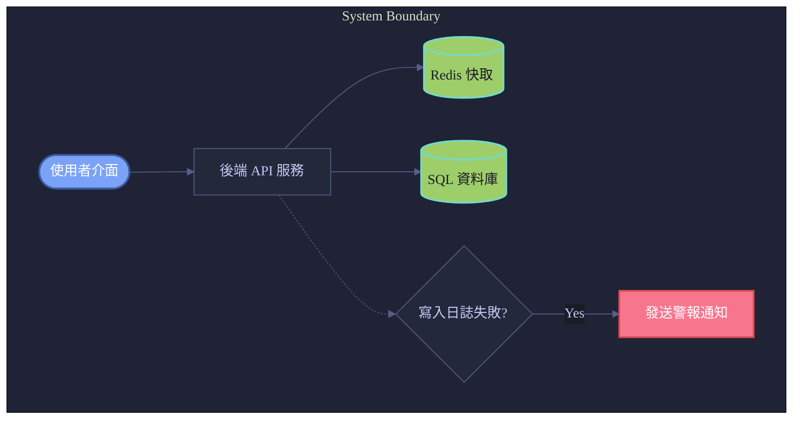
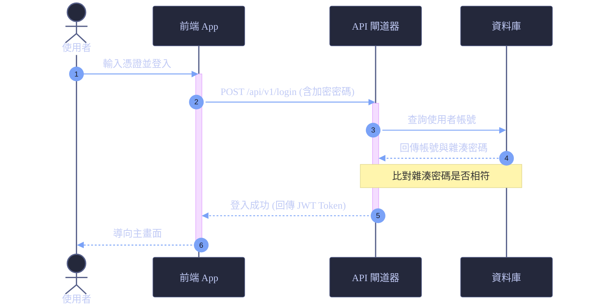

# Skill: Beautiful Mermaid
**Author:** Gemini CLI (Integrated)
**Version:** 1.2.0
**Description:** 產出極具美感的 Mermaid 圖表（Block Diagram, Sequence, Flowchart），針對 Obsidian 渲染進行優化。

## 🎨 核心設計美學
當生成 Mermaid 圖表時，請遵循以下優化規則，打造媲美專業設計工具（如 Figma, Excalidraw）的極致視覺體驗：

1. **全域初始化配置 (Mermaid Init Directive)**:
   - 務必在圖表最頂部加入 `%%{init: { ... }}%%` 設定全域樣式（字型、線條與基底配色）。
   - 推薦字型：`Inter`, `Outfit`, `PingFang TC`, `Microsoft JhengHei`。

2. **精選配色主題 (Curated Color Palettes)**:
   - **Tokyo Night (推薦/預設)**: 深邃科技感藍紫調
     - 主節點 (Primary): `#7aa2f7` (藍) / 文字 `#ffffff`
     - 資料庫 (Database): `#9ece6a` (綠) / 文字 `#1a1b26`
     - 條件決策 (Decision): `#bb9af7` (紫) / 文字 `#ffffff`
     - 警報/異常 (Warning): `#f7768e` (紅) / 文字 `#ffffff`
     - 輔助說明 (Note): `#e0af68` (黃) / 文字 `#1a1b26`
     - 背景邊線 (Stroke/Border): `#24283b` 或 `#1f2335`
   - **Catppuccin**: 柔和粉彩調
     - Lavender: `#b4befe`, Green: `#a6e3a1`, Mauve: `#cba6f7`, Red: `#f38ba8`, Peach: `#fab387`
   - **Nord**: 極簡北歐冷灰調
     - Frost Blue: `#88c0d0`, Green: `#a3be8c`, Purple: `#b48ead`, Red: `#bf616a`, Yellow: `#ebcb8b`

3. **節點樣式與層次 (Hierarchy & Shapes)**:
   - 使用不同的幾何形狀區分層次：
     - 開始/結束：圓角矩形 `Node([Text])`
     - 處理步驟：普通矩形 `Node[Text]`
     - 決策判斷：菱形 `Node{Text}`
     - 資料庫/儲存：圓柱體 `Node[(Text)]`
     - 子系統/容器：`subgraph` 區塊
   - 節點邊框不要過粗（推薦 1px ~ 2px），並搭配圓角 (Round corners)。

---

## 🛠️ 樣式模板與範例

### 1. 流程圖 / 區塊圖 (Flowchart / Block Diagram)

### 2. 時序圖 (Sequence Diagram)

---

## 💡 Obsidian 優化要點
1. **主題適配性**：在定義顏色時，優先選擇「在暗色主題下清晰、在亮色主題下也不會刺眼」的色彩組合（例如 Tokyo Night 降飽和度的配色）。
2. **語法相容性**：避免在節點中使用未跳脫的 HTML 標籤或複雜特殊字元，以防止 Obsidian 渲染解析出錯。文字若含括號，請使用引號包裹（如：`Node["Label (Info)"]`）。
