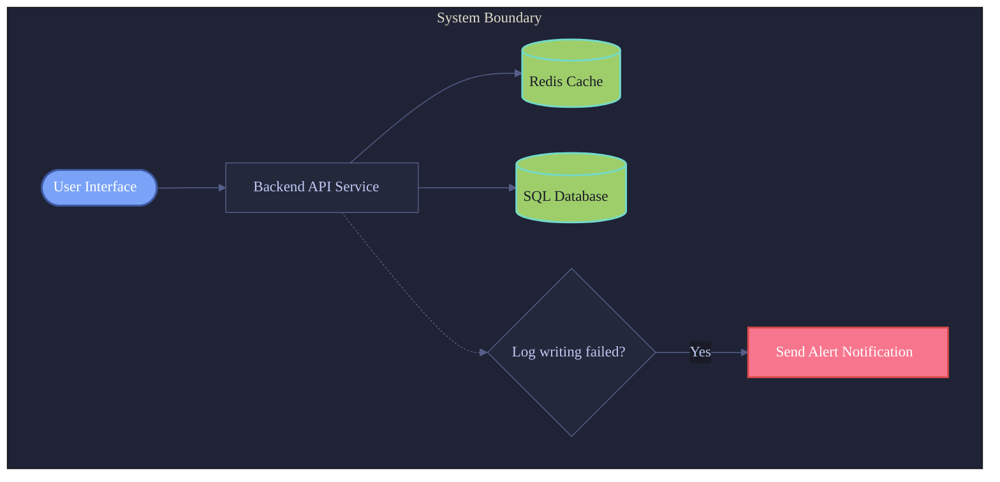
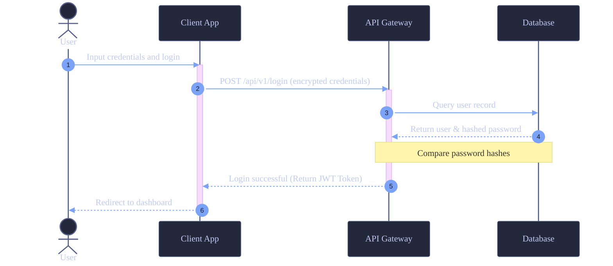

# Skill: Beautiful Mermaid
**Author:** Gemini CLI (Integrated)
**Version:** 1.2.0
**Description:** Generate highly aesthetic Mermaid diagrams (Block Diagram, Sequence, Flowchart) optimized for Obsidian rendering.

## 🎨 Core Design Aesthetics
When generating Mermaid diagrams, follow these optimization rules to deliver a premium, professional-grade visual experience comparable to tools like Figma or Excalidraw:

1. **Global Initialization Directive (Mermaid Init Directive)**:
   - Always include the `%%{init: { ... }}%%` block at the very top of your diagram to configure global fonts, lines, and base colors.
   - Recommended Fonts: `Inter`, `Outfit`, `PingFang TC`, `Segoe UI`, `system-ui`.

2. **Curated Color Palettes**:
   - **Tokyo Night (Default / Recommended)**: Deep, cybernetic blue/purple tone.
     - Primary Node: `#7aa2f7` (Blue) / Text `#ffffff`
     - Database: `#9ece6a` (Green) / Text `#1a1b26`
     - Decision/Condition: `#bb9af7` (Purple) / Text `#ffffff`
     - Warning/Error: `#f7768e` (Red) / Text `#ffffff`
     - Notes/Comments: `#e0af68` (Yellow) / Text `#1a1b26`
     - Stroke/Border: `#24283b` or `#1f2335`
   - **Catppuccin**: Soft, pastel tones.
     - Lavender: `#b4befe`, Green: `#a6e3a1`, Mauve: `#cba6f7`, Red: `#f38ba8`, Peach: `#fab387`
   - **Nord**: Minimalist, Nordic cold-grey tone.
     - Frost Blue: `#88c0d0`, Green: `#a3be8c`, Purple: `#b48ead`, Red: `#bf616a`, Yellow: `#ebcb8b`

3. **Node Styles & Hierarchy (Shapes)**:
   - Differentiate layers using distinct geometric shapes:
     - Start / End / Entrance: Rounded rectangle `Node([Text])` or capsule.
     - Process / Action: Standard rectangle `Node[Text]`.
     - Decision / Logic: Diamond shape `Node{Text}`.
     - Database / Storage: Cylindrical database shape `Node[(Text)]`.
     - Subsystems / Containers: Structured `subgraph` blocks.
   - Keep node borders thin (1px ~ 2px recommended) and use rounded corners.

---

## 🛠️ Style Templates & Examples

### 1. Flowchart / Block Diagram

### 2. Sequence Diagram

---

## 💡 Obsidian Optimization Tips
1. **Theme Adaptability**: When defining custom colors, prioritize color schemes that remain legible and comfortable to look at in both light and dark themes (such as desaturated Tokyo Night tones). If you want background to adapt to light mode automatically, recommend omitting the `"background"` parameter.
2. **Syntax Compatibility**: Avoid raw HTML tags or unescaped special characters inside node labels to prevent rendering parsing issues in Obsidian. If labels contain parentheses or brackets, wrap the label text in double quotes (e.g., `Node["Label (Info)"]`).
