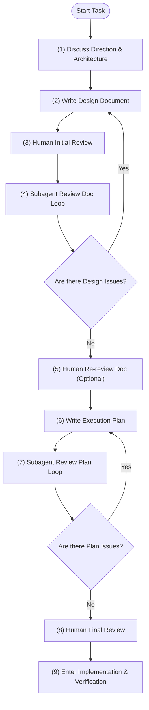

# Human-Agent-in-the-Loop Development Skill

## Description
This skill defines the Human-Agent-in-the-Loop (HAIL) development workflow, ensuring proper design, plan writing, and multi-stage adversarial reviews (using subagents and humans) before any implementation code is written.

## Version
1.0.0

## Change List
- **v1.0.0 (Initial Release)**: 
  - Designed the 9-phase Human-Agent-in-the-Loop (HAIL) planning workflow.
  - Implemented the custom loop controller script `hail-loop.sh` to track workflow state.
  - Created initial documentation (`SKILL.md`, `README.md`).

## Code Structure
```
human-agent-in-the-loop-development/
├── SKILL.md               # Main Antigravity skill definition (English)
├── README.md              # Skill documentation (this file)
└── scripts/
    └── hail-loop.sh       # Custom workflow controller and state manager
```

## Workflow Diagram


