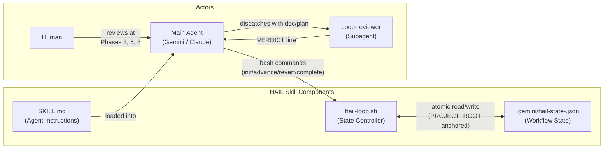
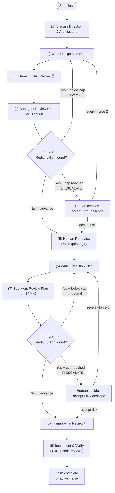

# Human-Agent-in-the-Loop Development Skill

#hail #workflow #skill #2026-06-22

## Description

This skill defines the Human-Agent-in-the-Loop (HAIL) development workflow, ensuring proper design, plan writing, and multi-stage adversarial reviews (using subagents and humans) before any implementation code is written.

## Version

1.7.0

## Change List

- **v1.7.0 (2026-06-22)** — Major security hardening, bug fixes, and POSIX ERE/BRE compatibility update via dual adversarial AI code review (Gemini 3.1 Pro + Gemini 3.5 Flash)
  - Support global skill execution by updating `HAIL_SCRIPT` discovery in `SKILL.md` to search both `~/.gemini/skills` and `$PROJECT_ROOT` (fixes setup failure when skill is installed globally)
  - Synchronize branch-specific state file naming (`hail-state-<branch>.json`) and lock directory (`.hail-<branch>.lock`) across `README.md` and `SKILL.md` (fixes doc inconsistency)
  - Prevent iteration cap counter reset on standard reverts (`revert 2` and `revert 6`) by using strict inequality (`-lt`) in `hail-loop.sh` (fixes infinite review loop vulnerability)
  - Prevent TOCTOU lock recovery race condition in `acquire_lock` by introducing atomic rename staging (`.stale.$$`) and PID recording (fixes concurrent state corruption)
  - Eliminate torn state reads during multi-step `sed -i` fallback operations by enforcing `acquire_lock` at the start of `show_status`
  - Update `complete_workflow` POSIX BRE regex to `[0-9][0-9]*` for proper digit matching without `-E` flag
  - Rewrite `read_json_field` grep/sed fallback pathway (`sed -n`) to prevent truncation of ISO-8601 timestamps and comma-delimited paths
  - Guard `init_state` against overwriting in-progress Phase 9 implementation workflows without `--force` flag
  - Double quote `$HOME` in script search command to prevent word splitting

- **v1.6.0 (2026-06-21)** — Branch-specific state files, revert counter resetting, and embedded reviewer prompt rubric
  - Support branch isolation by appending current branch name to state JSON and lock directory (fixes state conflicts between parallel development branches)
  - Reset iteration counters (`doc_review_iterations` and `plan_review_iterations`) when reverting past their respective creation boundaries (fixes permanent lockup on escalation)
  - Embed severity rubric definitions directly into Phase 4 and Phase 7 reviewer prompt templates in `SKILL.md` (fixes missing rubric context in reviewer subagents)

- **v1.5.1 (2026-06-21)** — Fixed Opus Round 1 review findings (1 HIGH, 1 MEDIUM, 1 LOW)
  - FIX(HIGH): `read_json_field` jq path changed from `.field // empty` to `.field | if . == null then empty else . end`; the `//` alternative operator treats `false` as falsy, returning `""` instead of `"false"` — silently breaking the `active=false` guards in `advance_phase` and `show_status`
  - FIX(MEDIUM): `read_json_field` python3 path now uses `.lower()` on bool values so `False` → `"false"`, matching jq and grep output; previously the `init_state` re-init guard and `advance_phase`/`show_status` guards were all broken under python3
  - FIX(LOW): `cleanup` uses `${TEMP_FILES[@]+"${TEMP_FILES[@]}"}` instead of `${TEMP_FILES[@]:-}` to skip iteration when array is empty, avoiding a spurious `rm -f ""` on bash 3.2

- **v1.5.0 (2026-06-21)** — Fixed all adversarial review findings (1 HIGH, 4 MEDIUM, 4 LOW)
  - FIX(HIGH): `init_state` now acquires lock before reading state to eliminate TOCTOU race condition
  - FIX(MEDIUM): `cancel_workflow` now acquires lock before `rm -f` to prevent race with concurrent write
  - FIX(MEDIUM): `complete_workflow` sed fallback now updates `phase`, `phase_name`, and `last_updated` (previously only updated `active`)
  - FIX(MEDIUM): temp files in `write_phase` and `complete_workflow` (jq path) registered in `TEMP_FILES` array; global `cleanup()` replaces `release_lock` as EXIT/INT/TERM trap to guarantee cleanup on failure
  - FIX(MEDIUM): Python heredocs in `write_phase`, `complete_workflow`, and `init_state` now use `<<'PYEOF'` + env vars to prevent single-quote injection via `$STATE_FILE` path and phase-name values
  - FIX(LOW): `init_state` jq path uses `jq -n --arg` for correct JSON escaping of doc/plan paths; python3 path passes paths via env vars; sed fallback sanitizes `\`, `$`, `` ` `` before heredoc interpolation
  - FIX(LOW): sed fallback `grep -o '[0-9]*'` changed to `grep -oE '[0-9]+'` to avoid zero-length matches on GNU grep
  - FIX(LOW): `advance_phase` now guards against advancing a completed (`active=false`) workflow
  - FIX(LOW): `show_status` now prints "✅ Workflow complete" instead of "🎉 Ready to Implement!" when `active=false`

- **v1.4.1 (2026-06-21)** — Fixed lock safety and macOS compatibility bugs
  - Fix global exit trap lock deletion bug by introducing `LOCK_ACQUIRED` state flag
  - Fix macOS `sed -i` fallback bug in `complete_workflow` by using global `sed_i` helper
  - Align `SKILL.md` flowchart with `README.md` by adding the `Done` node

- **v1.4.0 (2026-06-21)** — Fixed all Opus Round 2 review findings
  - Anchor `STATE_FILE` and `LOCK_DIR` to `git rev-parse --show-toplevel` (fixes silent state loss when agent `cd`s to subdirectory)
  - Anchor `SKILL.md` `find` command to `PROJECT_ROOT` (fixes `$HAIL_SCRIPT` being empty in subdirs)
  - Add `complete` command: atomic write of `active=false, phase=9`; allows re-`init` without `--force` after completion
  - `init` now allows reinit without `--force` when `active=false` or `phase=9`
  - Fix empty-file corruption guard: `[[ ! -s ]]` check before `jq -e .` (0-byte files were passing `jq empty`)
  - Make `init` write atomic via `mktemp` + `mv` (was `cat >` direct write)
  - Add stale lock auto-removal: lock dir older than 30s is cleared automatically
  - Add non-canonical revert warning for paths other than 4→2 and 7→6

- **v1.3.1 (2026-06-21)** — Increase `MAX_REVIEW_ITERATIONS` default from 3 to 10

- **v1.3.0 (2026-06-21)** — Fixed all Opus Round 1 review findings
  - Add `MAX_REVIEW_ITERATIONS` cap: `revert` blocked when cap reached, `advance` prints warning
  - Rewrite skill trigger `description` to exclude one-line fixes and config tweaks
  - Add Human Checkpoint Note: Phases 3, 5, 8 require agent to pause for human before advancing
  - Add Severity Rubric (High/Medium/Low) and VERDICT contract for structured subagent output
  - Guard `init` against overwriting an active workflow; atomic Python write; `mkdir`-based locking
  - Replace hardcoded script path with `find "$PROJECT_ROOT"`-based `$HAIL_SCRIPT` variable

- **v1.2.0 (2026-06-21)** — Add iteration counters
  - Track `doc_review_iterations` and `plan_review_iterations` in state JSON
  - Display counters in `status` output and Phase 4/7 next-step messages

- **v1.1.0 (2026-06-21)** — Add `revert` command and explicit subagent loop protocol
  - Add `revert [--force] <PHASE_NUMBER>` command to `hail-loop.sh`
  - Add explicit subagent loop decision protocol to `SKILL.md`

- **v1.0.0 (Initial Release)** — 9-phase HAIL workflow
  - Designed the 9-phase Human-Agent-in-the-Loop planning workflow
  - Implemented `hail-loop.sh` loop controller with `init`, `status`, `advance`, `cancel`
  - Created initial documentation (`SKILL.md`, `README.md`)

## Code Structure

```
human-agent-in-the-loop-development/
├── SKILL.md               # Main skill definition loaded into the agent
│                          #   • 9-phase Mermaid flowchart
│                          #   • Severity Rubric (High/Medium/Low) + VERDICT contract
│                          #   • Phase 4 & 7 prompt templates + decision protocol
│                          #   • Iteration Cap & Escalation policy
│                          #   • HAIL Loop Script usage guide
├── README.md              # Skill documentation and version history (this file)
└── scripts/
    └── hail-loop.sh       # Workflow loop controller and state manager
                           #   Commands: init, status, advance, revert, complete, cancel
                           #   State: $PROJECT_ROOT/.gemini/hail-state-<branch>.json (git-root anchored)
                           #   Lock:  $PROJECT_ROOT/.gemini/.hail-<branch>.lock (mkdir atomic)
```

## Architecture Block Diagram

Components and how they interact:



## Workflow Diagram

Full 9-phase flow with iteration cap and escalation paths:


