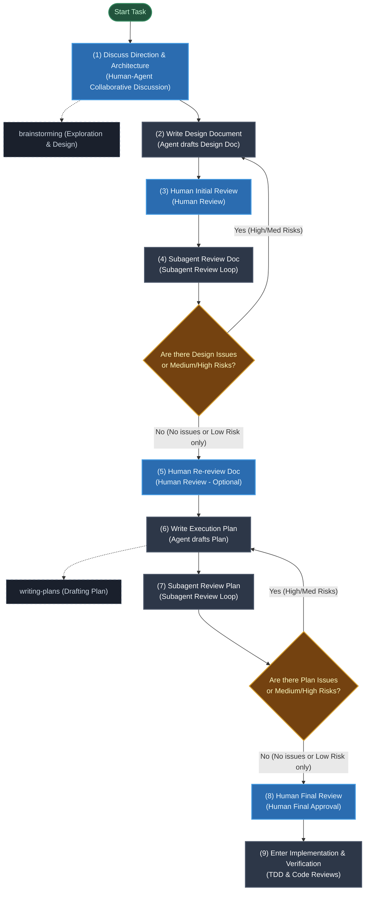

# Human-Agent-in-the-Loop Development Workflow

## Overview
This document defines the optimized **Human-Agent-in-the-Loop Development** workflow. Before implementation, a multi-stage process involving human-agent collaboration, design doc reviews, and adversarial subagent review loops is conducted to ensure correct direction, robust architecture, and a plan free of logical gaps.

## Core Design Philosophy
- **Design & Plan First**: Conduct multiple rounds of design and plan "Doc Reviews" before writing code to minimize the cost of downstream rework.
- **Human-Agent Collaboration**: Humans control the macro direction and final reviews, the agent drafts the technical design and execution plans, and subagents perform static adversarial reviews (Issue reviews) to find gaps.

## When to Use
Use when:
- Launching a new feature, large task, or complex bug fix that requires design decisions.
- Planning multi-step tasks or writing execution plans.
- Aligning with the human partner on architecture, API design, or database schemas.

Do NOT use for:
- Simple one-line bug fixes or minor configuration adjustments with no structural impact.

## Planning & Design Flowchart



## Detailed Steps & Skill Integration

| Step | Node Name | Owner / Method | Coordinated Superpowers Skill & Details |
| :--- | :--- | :--- | :--- |
| **(1)** | **Discuss Direction & Architecture** | Human-Agent | Use `brainstorming` to discuss macro architecture, align goals, and decide on the tech stack and core design direction. |
| **(2)** | **Write Design Document** | Agent (Main) | Based on alignment, produce a detailed technical design document (Design Doc). |
| **(3)** | **Human Initial Review** | Human | Human reviews the design document to ensure it has not drifted from the discussed architecture, providing initial feedback. |
| **(4)** | **Subagent Review Doc** | Subagent (Reviewer) | Launch the `code-reviewer` subagent to perform an adversarial review. If gaps are found, revert to step (2) for correction until no issues or low risks remain. |
| **(5)** | **Human Re-review Doc** | Human (Optional) | (Optional) Human confirms the final design doc optimized after the subagent review loop. |
| **(6)** | **Write Execution Plan** | Agent (Main) | Use the `writing-plans` skill to break down the approved design document into concrete, executable checkpoints. |
| **(7)** | **Subagent Review Plan** | Subagent (Reviewer) | Subagent reviews the execution plan to check if it covers all design details and if checkpoints are logical. Revert to step (6) if issues are found. |
| **(8)** | **Human Final Review** | Human | Human performs final approval of the plan, providing the green light to begin coding. |
| **(9)** | **Enter Implementation & Verification** | Agent + Subagent | Write code and tests following `test-driven-development` and `verification-before-completion` specifications. |

## HAIL Loop Script Control

This skill provides a dedicated workflow state management and loop control script. The agent can invoke this script to initialize state, check progress, and advance phases, avoiding external dependencies on `ralph-loop`.

### Usage

1. **Initialize HAIL Loop**:
   ```bash
   bash .agents/skills/human-agent-in-the-loop-development/scripts/hail-loop.sh init [DESIGN_DOC_PATH] [PLAN_PATH]
   ```

2. **Check Current Status & Next Steps**:
   ```bash
   bash .agents/skills/human-agent-in-the-loop-development/scripts/hail-loop.sh status
   ```

3. **Advance to the Next Phase** (e.g., after completing design or passing a review loop):
   ```bash
   bash .agents/skills/human-agent-in-the-loop-development/scripts/hail-loop.sh advance
   ```

4. **Reset or Cancel the Loop**:
   ```bash
   bash .agents/skills/human-agent-in-the-loop-development/scripts/hail-loop.sh cancel
   ```

### State Tracking
Workflow state information is stored in JSON format at `.gemini/hail-state.json`, making it easily readable and verifiable by both the agent and review subagents.
