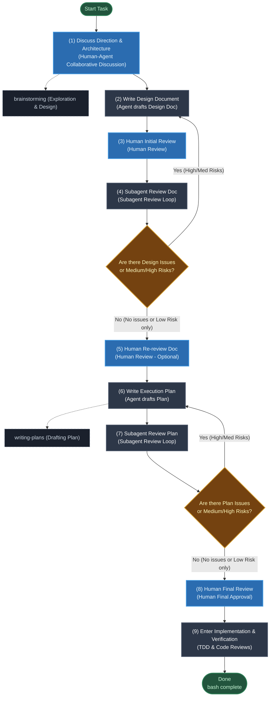

# Human-Agent-in-the-Loop Development Workflow

## Overview
This document defines the optimized **Human-Agent-in-the-Loop Development** workflow. Before implementation, a multi-stage process involving human-agent collaboration, design doc reviews, and adversarial subagent review loops is conducted to ensure correct direction, robust architecture, and a plan free of logical gaps.

## Core Design Philosophy
- **Design & Plan First**: Conduct multiple rounds of design and plan "Doc Reviews" before writing code to minimize the cost of downstream rework.
- **Human-Agent Collaboration**: Humans control the macro direction and final reviews, the agent drafts the technical design and execution plans, and subagents perform static adversarial reviews (Issue reviews) to find gaps.

## When to Use
Use when:
- Launching a new feature, large task, or complex bug fix that requires design decisions.
- Planning multi-step tasks or writing execution plans.
- Aligning with the human partner on architecture, API design, or database schemas.

Do NOT use for:
- Simple one-line bug fixes or minor configuration adjustments with no structural impact.

## Planning & Design Flowchart



## Detailed Steps & Skill Integration

| Step | Node Name | Owner / Method | Coordinated Superpowers Skill & Details |
| :--- | :--- | :--- | :--- |
| **(1)** | **Discuss Direction & Architecture** | Human-Agent | Use `brainstorming` to discuss macro architecture, align goals, and decide on the tech stack and core design direction. |
| **(2)** | **Write Design Document** | Agent (Main) | Based on alignment, produce a detailed technical design document (Design Doc). |
| **(3)** | **Human Initial Review** | Human | Human reviews the design document to ensure it has not drifted from the discussed architecture, providing initial feedback. |
| **(4)** | **Subagent Review Doc** | Subagent (Reviewer) | Launch the `code-reviewer` subagent to perform an adversarial review. If gaps are found, revert to step (2) for correction until no issues or low risks remain. |
| **(5)** | **Human Re-review Doc** | Human (Optional) | (Optional) Human confirms the final design doc optimized after the subagent review loop. |
| **(6)** | **Write Execution Plan** | Agent (Main) | Use the `writing-plans` skill to break down the approved design document into concrete, executable checkpoints. |
| **(7)** | **Subagent Review Plan** | Subagent (Reviewer) | Subagent reviews the execution plan to check if it covers all design details and if checkpoints are logical. Revert to step (6) if issues are found. |
| **(8)** | **Human Final Review** | Human | Human performs final approval of the plan, providing the green light to begin coding. |
| **(9)** | **Enter Implementation & Verification** | Agent + Subagent | Write code and tests following `test-driven-development` and `verification-before-completion` specifications. |

### Human Checkpoint Note

Phases 3, 5, and 8 are **human advisory checkpoints**. The `hail-loop.sh` script cannot enforce that a human has actually reviewed — it can only track phase state. The agent is expected to pause and present the artifact to the human before calling `advance` past these phases. The loop-back path after a Phase 4 review failure (`revert 2`) implies re-entering Phase 3 for human confirmation before returning to Phase 4 — this is the agent's responsibility to honor, not the script's.

## Subagent Review Loop Protocol

This is the decision protocol the agent MUST follow after each subagent review phase. It is the mechanism that makes the review loop self-correcting.

### Severity Rubric

All subagent reviews MUST classify each finding using this rubric:

| Severity | Definition | Example |
| :--- | :--- | :--- |
| **High** | Blocks the feature from working correctly, creates wrong architecture, or misses a critical requirement. Revert and fix immediately. | "The design uses a stateless API but requires session-level consistency — this will silently corrupt data under concurrency." |
| **Medium** | Significant gap, risk, or ambiguity that should be addressed before coding starts. Revert and fix unless the iteration cap is reached. | "The error handling strategy for third-party API timeouts is undefined — downstream code will have nowhere to propagate this." |
| **Low** | Minor improvement, nice-to-have, or edge case with low probability. Log and accept; do NOT revert. | "The naming convention for internal events is inconsistent across sections." |

The reviewer MUST end the response with one of:
- `"VERDICT: No Medium/High issues found."` — agent calls `advance`
- `"VERDICT: Medium/High issues found (listed above)."` — agent evaluates iteration cap, then calls `revert` or escalates

### Iteration Cap & Escalation

`hail-loop.sh` enforces a cap of **10 review iterations** per loop (configurable via `MAX_REVIEW_ITERATIONS`). When the cap is reached:
- `advance` to Phase 4 or 7 will print a `⚠️ ITERATION CAP REACHED` warning
- `revert` for the canonical paths (4→2, 7→6) is **blocked** and prints a `🚨 ESCALATE` message
- The agent must stop looping and present all outstanding issues to the human for a final decision
- The human may accept the risks, request one more targeted fix (using `revert --force`), or choose to descope

### Phase 4 — Subagent Review Doc

1. Dispatch a `code-reviewer` subagent with the design doc as input. Use this prompt template:

   > "Perform an adversarial review of the attached design document. Identify logical gaps, missing edge cases, undefined error handling, and architectural risks. Classify each finding as High / Medium / Low using the severity rubric in the HAIL skill. End with: VERDICT: No Medium/High issues found. OR VERDICT: Medium/High issues found (listed above)."

2. Read the VERDICT line and evaluate:
   - **"No Medium/High issues found"** → call `advance`, proceed to Phase 5
   - **"Medium/High issues found"** AND iteration count < cap → call `revert 2`, fix the design doc, re-enter Phase 3 (human review), then return to Phase 4
   - **"Medium/High issues found"** AND cap reached (`🚨 ESCALATE` message) → present all outstanding issues to the human for a final decision; do NOT call `revert` without human approval

```bash
# Review passed
bash "$HAIL_SCRIPT" advance

# Review failed, iteration count below cap
bash "$HAIL_SCRIPT" revert 2

# Cap reached — only with explicit human approval
bash "$HAIL_SCRIPT" revert --force 2
```

### Phase 7 — Subagent Review Plan

1. Dispatch a `code-reviewer` subagent with the execution plan as input. Use this prompt template:

   > "Perform an adversarial review of the attached execution plan. Verify it covers all requirements from the design doc, that each checkpoint is concrete and independently verifiable, and that the implementation order is logically sound. Classify each finding as High / Medium / Low using the severity rubric in the HAIL skill. End with: VERDICT: No Medium/High issues found. OR VERDICT: Medium/High issues found (listed above)."

2. Read the VERDICT line and evaluate:
   - **"No Medium/High issues found"** → call `advance`, proceed to Phase 8
   - **"Medium/High issues found"** AND iteration count < cap → call `revert 6`, fix the plan, re-enter Phase 7
   - **"Medium/High issues found"** AND cap reached → escalate to human; do NOT revert without approval

```bash
# Review passed
bash "$HAIL_SCRIPT" advance

# Review failed, iteration count below cap
bash "$HAIL_SCRIPT" revert 6

# Cap reached — only with explicit human approval
bash "$HAIL_SCRIPT" revert --force 6
```

## HAIL Loop Script Control

This skill provides a dedicated workflow state management and loop control script. The agent can invoke this script to initialize state, check progress, advance phases, or revert to an earlier phase when a review fails.

### Setup

Locate the script once at the start of a session and store it in a variable:

```bash
PROJECT_ROOT=$(git rev-parse --show-toplevel 2>/dev/null || pwd)
HAIL_SCRIPT=$(find "$PROJECT_ROOT" -name hail-loop.sh -path "*/human-agent-in-the-loop-development/*" | head -1)
```

Use `$HAIL_SCRIPT` in all commands below. Anchoring to `PROJECT_ROOT` ensures the script is found regardless of which subdirectory the agent is currently in.

### Usage

1. **Initialize HAIL Loop**:
   ```bash
   bash "$HAIL_SCRIPT" init [DESIGN_DOC_PATH] [PLAN_PATH]
   # If a loop is already active, use --force to overwrite:
   bash "$HAIL_SCRIPT" init --force [DESIGN_DOC_PATH] [PLAN_PATH]
   ```

2. **Check Current Status & Next Steps**:
   ```bash
   bash "$HAIL_SCRIPT" status
   ```

3. **Advance to the Next Phase** (after a step completes or a review passes):
   ```bash
   bash "$HAIL_SCRIPT" advance
   ```

4. **Revert to a Previous Phase** (after a review finds Medium/High issues):
   ```bash
   bash "$HAIL_SCRIPT" revert <PHASE_NUMBER>
   # Blocked at the iteration cap — use --force only with human approval:
   bash "$HAIL_SCRIPT" revert --force <PHASE_NUMBER>
   ```
   Common revert targets:
   - `revert 2` — design doc review (Phase 4) found issues → rewrite design doc
   - `revert 6` — plan review (Phase 7) found issues → rewrite plan

5. **Mark Workflow Complete** (after implementation is done):
   ```bash
   bash "$HAIL_SCRIPT" complete
   ```
   Marks `active: false` and preserves state for reference. After `complete`, `init` can be run without `--force` to start a new workflow.

6. **Reset or Cancel the Loop**:
   ```bash
   bash "$HAIL_SCRIPT" cancel
   ```

### State Tracking
Workflow state is stored at `$PROJECT_ROOT/.gemini/hail-state.json` (project-root relative, not cwd-relative — safe across subdirectory changes). Fields include `phase`, `doc_review_iterations`, `plan_review_iterations`, and timestamps — readable by both the agent and review subagents.

If the state file is corrupted or empty, run `bash "$HAIL_SCRIPT" init --force` to reset.
